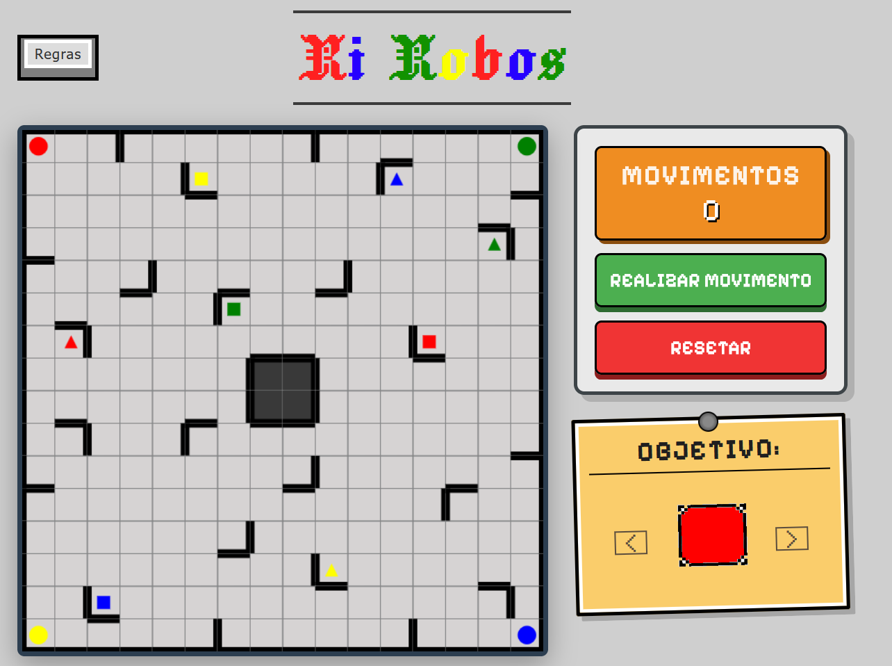
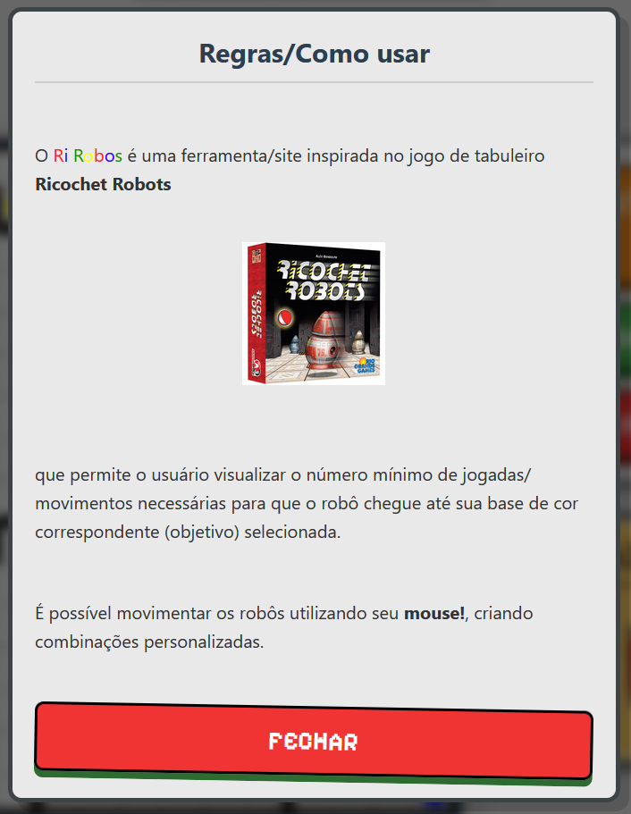
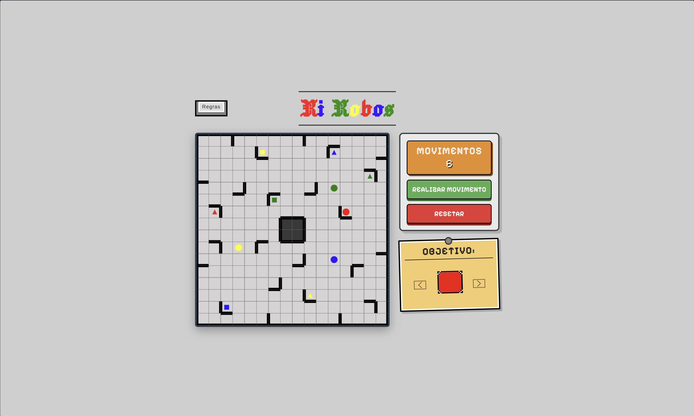

# Grafos1_RiRobos_bfs

**Número da Lista**: 24<br>
**Conteúdo da Disciplina**: Grafo 1<br>

## Alunos
|Matrícula | Aluno |
| -- | -- |
| 23/1039113  |  Leonardo Porporati Barcellos |
| 23/1039187  |  Yzabella Miranda Pimenta |

## Sobre 
Este projeto implementa busca em grafos com BFS no contexto do jogo Ricochet Robots.
O objetivo principal é praticar a implementação dos algoritmos ensinados na disciplina de Projeto de Algoritmos aplicando BFS em um grafo de posições, permitindo obter o caminho mínimo de uma configuração dos robôs.
Tanto o mapa (labirinto) quanto as regras foram tiradas do jogo de tabuleiro oficial Ricochet Robots criado em 1999 https://en.wikipedia.org/wiki/Ricochet_Robots

O programa encontra o menor caminho para o robô objetivo alcançar sua base usando BFS, com visualização em uma interface web interativa.

## Screenshots

<p align="center">
  
  <br>
  <sub>Captura de tela da interface inicial (jogo)</sub>
</p>

---

<p align="center">
  
  <br>
  <sub>Captura de tela da aba de regras</sub>
</p>

---

<p align="center">
  
  <br>
  <sub>Visualização da busca e do caminho encontrado</sub>
</p>


## Instalação 
**Linguagem**: JavaScript, HTML e CSS  
**Framework**: Não foi utilizado  
**Pré-requisitos**: Node.js (com npx) e navegador web atualizado

### Como rodar

1. Clonar o repositório

```bash
git clone https://github.com/projeto-de-algoritmos-2026/G24_Grafos_PA-26.1.git
cd G24_Grafos_PA-26.1
```

2. Iniciar o servidor local na raiz do projeto

```bash
npx serve .
```

3. Abrir no navegador

```txt
http://localhost:3000/front/index.html
```

4. Encerrar o servidor quando terminar

```bash
Ctrl + C
```

> Alternativa caso prefira outro servidor local:
>
> ```bash
> npx http-server .
> ```

## Vídeo de Apresentação

<p align="center">
  Neste vídeo, apresentaremos o trabalho desenvolvido:
</p>

<p align="center">
  <a href="https://youtu.be/GBx2gQw55AY" target="_blank">
    
  </a>
</p>

<p align="center">
  <a href="https://youtu.be/GBx2gQw55AY">https://youtu.be/GBx2gQw55AY</a>
</p>
