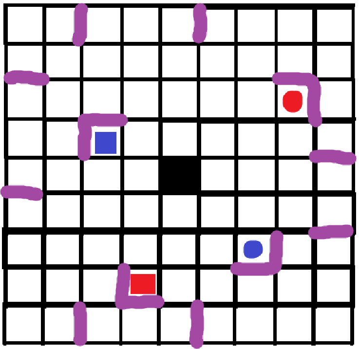

vou usar esse .md aqui para alguns logs

fiz o mapa hard-coded, vamo pegar os x e y pra montar o jogo baseado neles...
fiz para ver como deve ser o resultado do mapa fixo.

eis locais de muro:

  //locais de muro (x,y):
  //  2,0 (topo)
  //  4,8 (topo)
  //  6,8 (topo)
  //  5,0 (topo)

  //  0,2 (esq.)
  //  8,2 (esq.)
  //  8,5 (esq.)
  //  0,5 (esq.)

  //  7,3 (baixo + esq)
  //  6,6 (baixo + dir)

  //  3,2 (topo + esq)
  //  2,7 (topo + dir)

  //  4,4 (CENTRO)

  